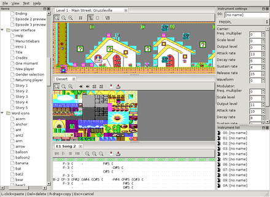

<!--@
TITLE=Camoto Desktop - shikadi.net
-->
# Camoto Desktop #

<b>Camoto Desktop</b> is a now discontinued collection of integrated utilities
for editing (modding) "classic DOS games", those running under MS-DOS on the PC
from the early to mid 1990s.

It has been superseded by [Camoto Online](../), a Javascript rewrite that runs
in a web browser.  The rest of this page applies to the discontinued version
and is left available for historical reasons.

## News - December 2020 ##

I have decided to "retire" the current version of Camoto, due to the following
reasons:

* The group of people who are interested in modding DOS games and familiar with
  C++ is vanishingly small, so few people have been able to contribute to the
  codebase, despite quite a lot of interest.
* Getting Camoto Studio to compile under Windows is an exercise in frustration,
  and wastes weeks of effort that could be better spent adding support for more
  games.
* Getting Camoto Studio to run under Windows is also difficult, whether it's
  different versions of Windows missing DLLs or over-zealous virus scanners
  flagging it as malware, it requires a lot of time just to provide basic
  support.

For these reasons I have stopped work on the C++ version of Camoto Studio and
all the libgame* libraries.  I have no objection to anyone who wants to
contribute to the libgame* libraries and will happily merge PRs over on GitHub,
however I have no desire to continue working on the desktop version of Camoto
Studio as the GUI code gives you an incredibly low return on the time you
invest writing it.

Instead, my new plan is to switch to a more modern language and environment,
namely JavaScript and the web browser.  I am planning to rewrite all the
libgame* libraries in JS (using NodeJS to provide the command line interfaces),
and create a web-based version of Camoto Studio instead of the desktop version.
This means no need to compile on Windows, so installation problems, the future
possibility of having it work on mobile devices like an app, and most
importantly hopefully a wider pool of people who will be able to contribute
code to the project.

In the past I have always been enthusiastic about adding support for lots of
different games and file formats, even before the functionality was there to
make use of them, however this backfired somewhat.  Many people complained that
their favourite game had only incomplete support and they got their hopes up
only to have them dashed, when they found that some critical feature was
missing or something didn't work as expected.  So this time I am focusing on
getting everything fully working for only a much smaller number of games first,
so that hopefully the games that are supported will work much better than they
have with the older Camoto versions.

## Main features ##

<figure>

<figcaption>
Editing <a href="https://moddingwiki.shikadi.net/w/Monster Bash">Monster Bash</a> with Camoto 2013-09-27
</figcaption>
</figure>

<figure>

<figcaption>
Editing <a href="https://moddingwiki.shikadi.net/wiki/Crystal_Caves">Crystal Caves</a> with Camoto 2013-09-27
</figcaption>
</figure>

* Map editor for 2D tile-based/grid maps (most platform games, some early FPS
  games)
* Export and import images and tilesets as .png files with transparency
* Listen to Ad Lib music via software OPL synth (borrowed from DOSBox)
* Edits files directly inside group/archive files, no need to extract them
  first or merge them later
* Works with files in their native format, no need to distribute images of
  tilesets, and when changes are saved they are immediately visible if the game
  is launched
* Consistent user interface for editing many different games

See the [list of supported games](gamelist/).

### Future expansion ###

These features have not yet been implemented, but are considered most important for future versions:

* Automatically decompress .exe files (e.g. with unlzexe).  This must be done
  manually at present.
* Package up a modified game into a single .exe that can be placed into a
  game's folder, and run without disturbing the original game files.
* Opening standalone songs and allowing conversion to all supported formats
  (to replace [DRO2MIDI](${PREFIX}/utils/dro2midi).)

See also the [to-do list](https://github.com/Malvineous/camoto-studio/wiki).

## Help / Discussion ##

<figure>

<figcaption>
Editing <a href="https://moddingwiki.shikadi.net/wiki/Zone_66">Zone 66</a> with Camoto 2014-12-05
</figcaption>
</figure>

If you're new to Camoto, see TODO[Getting Started with Camoto
Studio](getting-started/).

The 'official' help forum for Camoto is the [RGB Classic Games modding
forum](http://www.classicdosgames.com/forum/viewforum.php?f=25).  If you run
into problems or have questions about Camoto, please ask them there.

You can watch development progress by following
[@CamotoModding](http://twitter.com/#!/CamotoModding) on Twitter.

## Contributing ##

Camoto is open source - please contribute!  There are many ways in which you
can help:

* Edit some games and if you find something that doesn't work properly, make
  sure it's on
  [the to-do list](https://github.com/Malvineous/camoto-studio/wiki)
* If Camoto can edit file formats from a game but it's not in Camoto Studio's
  list of games, add it!  See: [How to add a new game to Camoto
  Studio](help-new/)
* If there are any file formats used by DOS games you know about, make sure
  they are listed on the
  <a href="https://moddingwiki.shikadi.net/wiki/Category:File_Formats">ModdingWiki</a>
* If you know C++, find some
  <a href="https://moddingwiki.shikadi.net/wiki/Category:File_Formats">file
  formats on the ModdingWiki</a> which haven't yet been implemented in Camoto
  and add them!  See: [How to add a new archive format to
  Camoto](help-archive-new/)
* Keep an eye on the [RGB Classic Games modding
  forum](http://www.classicdosgames.com/forum/viewforum.php?f=25) and help out
  anyone who's stuck modding or reverse engineering their favourite game!

## Download ##

### Windows ###

<ul class="download">
	<li class="win">
		<a href="http://files.shikadi.net/camoto/desktop/camoto-install-20150221.exe">camoto-install-20150221.exe</a>
		(Windows 32-bit, 9.8 MB, <a href="https://github.com/Malvineous/camoto-studio">git</a>) - released 2015-02-21
	</li>
	<li class="win">
		Previous version:
		<a href="http://files.shikadi.net/camoto/desktop/camoto-install-20140115.exe">camoto-install-20140115.exe</a>
		(Windows 32-bit, 4.3 MB - released 2014-01-15
	</li>
</ul>

### Linux / Source code ###

<ul class="download">
	<li class="source">
		<a href="https://github.com/Malvineous/libgamecommon/releases/download/v1.2/libgamecommon-1.2.tar.bz2">libgamecommon-1.2.tar.bz2</a>
		(source only, 342 kB, <a href="https://github.com/Malvineous/libgamecommon">git</a>) - released 2015-02-21</li>
	<li class="source"><a href="https://github.com/Malvineous/libgamearchive/releases/download/v1.2/libgamearchive-1.2.tar.bz2">libgamearchive-1.2.tar.bz2</a> (source only, 437 kB, <a href="https://github.com/Malvineous/libgamearchive">git</a>) - released 2015-02-21</li>
	<li class="source"><a href="https://github.com/Malvineous/libgamegraphics/releases/download/v1.2/libgamegraphics-1.2.tar.bz2">libgamegraphics-1.2.tar.bz2</a> (source only, 423 kB, <a href="https://github.com/Malvineous/libgamegraphics">git</a>) - released 2015-02-21</li>
	<li class="source"><a href="https://github.com/Malvineous/libgamemaps/releases/download/v1.2/libgamemaps-1.2.tar.bz2">libgamemaps-1.2.tar.bz2</a> (source only, 402 kB, <a href="https://github.com/Malvineous/libgamemaps">git</a>) - released 2015-02-21</li>
	<li class="source"><a href="https://github.com/Malvineous/libgamemusic/releases/download/v1.2/libgamemusic-1.2.tar.bz2">libgamemusic-1.2.tar.bz2</a> (source only, 475 kB, <a href="https://github.com/Malvineous/libgamemusic">git</a>) - released 2015-02-21</li>
	<li class="source"><a href="https://github.com/Malvineous/camoto-studio/releases/download/v1.2/camoto-studio-1.2.tar.bz2">camoto-studio-1.2.tar.bz2</a> (source only, 719 kB, <a href="https://github.com/Malvineous/camoto-studio">git</a>) - released 2015-02-21</li>
</ul>

### Build instructions ###

<figure>

<figcaption>
Editing <a href="https://moddingwiki.shikadi.net/wiki/Word_Rescue">Word Rescue</a> with Camoto 2013-09-27
</figcaption>
</figure>

The Camoto libraries underwent a significant rewrite in July 2016.  Please
ensure you use the '''v1.x''' git branch for all components if you want to
compile the GUI.  But if you want to contribute, please use the '''master'''
branch as this is where all work is being done.  The wxWidgets v1.x GUI has
been discontinued, and a new GTK-based GUI is being written to replace it.  The
table below illustrates progress on the rewrite - those components with a tick
are fully functional, while those with a cross have not yet reached a stage
where they are usable (and may not even compile.)

<table class="wikitable">
	<thead>
		<tr>
			<th>Component</th>
			<th>v1.x</th>
			<th>master</th>
		</tr>
	</thead>
	<tbody>
		<tr>
			<td>libgamecommon</td>
			<td></td>
			<td></td>
		</tr>
		<tr>
			<td>libgamearchive</td>
			<td></td>
			<td></td>
		</tr>
		<tr>
			<td>libgamegraphics</td>
			<td></td>
			<td></td>
		</tr>
		<tr>
			<td>libgamemaps</td>
			<td></td>
			<td></td>
		</tr>
		<tr>
			<td>libgamemusic</td>
			<td></td>
			<td></td>
		</tr>
		<tr>
			<td>camoto-studio</td>
			<td></td>
			<td></td>
		</tr>
	</tbody>
</table>

For Windows, see [How to compile Camoto with Visual Studio](help-build-win32/).

Under Linux, the code is compiled in the usual way:

    $ git clone git://github.com/Malvineous/libgamecommon.git
    $ cd libgamecommon
    $ ./autogen.sh
    $ ./configure && make && sudo make install

Repeat for each of the Camoto support libraries.  The order of the libraries is important:

1. libgamecommon must be first
2. libgamearchive, libgamegraphics, libgamemusic can be done next, in any order
3. libgamemaps must be done after libgamegraphics
4. camoto-studio must be done last of all

#### Dependencies ####

Here is a full the list of dependencies:

* libgamecommon: boost (test)
* libgamearchive: boost (filesystem, program options, test), libgamecommon
* libgamegraphics: boost (program options, test), libpng, pngpp, libgamecommon
* libgamemaps: boost (filesystem, program options, test), libpng, pngpp, libgamegraphics, libgamecommon
* libgamemusic: boost (filesystem, program options, threads, test), portaudio (optional), libgamecommon
* camoto-studio: boost (filesystem, threads), libpng, pngpp, wxwidgets >= 2.9.4 w/ GL support, libxml2, portaudio, glew, all libgame* libraries
* boost means boost >= 1.60
* pngpp means png++ >= 0.2.7
* portaudio means portaudio >= 2.0

## User interfaces ##

The Camoto suite has a number of command-line interfaces to its functionality, as well as a single GUI that combines everything into one IDE-like environment.

<table class="wikitable">
	<thead>
		<tr>
			<th>Application</th>
			<th>Library</th>
			<th>Description</th>
		</tr>
	</thead>
	<tbody>
		<tr>
			<td>Camoto Studio (GUI)</td>
			<td>camoto-studio</td>
			<td>
				Cross-platform GUI combining the entire Camoto suite into a single
				integrated application
			</td>
		</tr>
		<tr>
			<td><a href="manpage-gamearch">gamearch</a></td>
			<td>libgamearchive</td>
			<td>View and edit group/archive files (like zip/unzip)</td>
		</tr>
		<tr>
			<td><a href="manpage-gamecomp">gamecomp</a></td>
			<td>libgamearchive</td>
			<td>Encrypt/decrypt and compress/decompress individual files</td>
		</tr>
		<tr>
			<td><a href="manpage-gametls">gametls</a></td>
			<td>libgamegraphics</td>
			<td>
				Extract (as .png), view (in ANSI/ASCII) and replace images within a
				tileset (a tileset is a single file containing many images)
			</td>
		</tr>
		<tr>
			<td><a href="manpage-gameimg">gameimg</a></td>
			<td>libgamegraphics</td>
			<td>View (in ANSI/ASCII) and replace single-image graphics files</td>
		</tr>
		<tr>
			<td><a href="manpage-gamemap">gamemap</a></td>
			<td>libgamemaps</td>
			<td>Examine game levels (hex dump, print metadata)</td>
		</tr>
		<tr>
			<td><a href="manpage-gamemus">gamemus</a></td>
			<td>libgamemusic</td>
			<td>Import, export and basic conversion of game music files</td>
		</tr>
		<tr>
			<td><a href="manpage-dro2txt">dro2txt</a></td>
			<td>libgamemusic</td>
			<td>
				Dump events in DOSBox .dro captures as text.  Events are handled so
				that OPL register writes in a different order won't change the output,
				providing the audio would sound the same, making it useful to use with
				a diff utility to compare two .dro files.  Very useful to compare your
				own Adlib player with another one to ensure playback accuracy.
			</td>
		</tr>
		<tr>
			<td>dumppal</td>
			<td>libgamegraphics</td>
			<td>Read a .png image and dump the palette in a supported file format.</td>
		</tr>
		<tr>
			<td>dumpb800</td>
			<td>libgamegraphics</td>
			<td>
				Read a 4000-byte B800 text screen on stdin, and write it to stdout,
				using ANSI colour escape codes so it is readable in a terminal.  (You
				may still have to pass it through <tt>iconv -f cp437</tt> to convert
				the glyphs, if you have a UTF8 terminal.)
			</td>
		</tr>
	</tbody>
</table>

## Developers ##

The Camoto codebase is broken up into the following libraries.  Each library name is a link to the Doxygen documentation for that library.

<table class="wikitable">
	<thead>
		<tr>
			<th>Library</th>
			<th>Issues&nbsp;link</th>
			<th>Description</th>
		</tr>
	</thead>
	<tbody>
		<tr>
			<td>
				<a href="http://www.shikadi.net/camoto/doc/libgamecommon/">libgamecommon</a>
			</td>
			<td>
				<a href="https://github.com/Malvineous/libgamecommon/issues">report bug</a>
			</td>
			<td>
				Common functionality shared by multiple libraries.  Endian independent
				stream functions, methods for reading and writing streams in units
				other than 8-bit bytes, and helper functions for various common tasks.
			</td>
		</tr>
		<tr>
			<td>
				<a href="http://www.shikadi.net/camoto/doc/libgamearchive/">libgamearchive</a>
			</td>
			<td>
				<a href="https://github.com/Malvineous/libgamearchive/issues">report bug</a>
			</td>
			<td>
				Interface to game archives (like .zip files where lots of game data is
				stored in one big file.)  Allows full editing of supported file types.
			</td>
		</tr>
		<tr>
			<td>
				<a href="http://www.shikadi.net/camoto/doc/libgamegraphics/">libgamegraphics</a>
			</td>
			<td>
				<a href="https://github.com/Malvineous/libgamegraphics/issues">report bug</a>
			</td>
			<td>
				Examine, convert and modify game graphics in all their multitude of
				formats.  This includes tilesets, sprites, backgrounds, animations, etc.
			</td>
		</tr>
		<tr>
			<td>
				<a href="http://www.shikadi.net/camoto/doc/libgamemaps/">libgamemaps</a>
			</td>
			<td>
				<a href="https://github.com/Malvineous/libgamemaps/issues">report bug</a>
			</td>
			<td>
				Provide a standard method of level editing.  This will (initially) only
				support 2D grid-based maps, which means platform games and some early 3D
				games.
			</td>
		</tr>
		<tr>
			<td>
				<a href="http://www.shikadi.net/camoto/doc/libgamemusic/">libgamemusic</a>
			</td>
			<td>
				<a href="https://github.com/Malvineous/libgamemusic/issues">report bug</a>
			</td>
			<td>
				Play and convert music from supported games.  The UI for this component
				will include real-time OPL/Adlib conversion to MIDI (to replace
				<a href="../../utils/dro2midi">DRO2MIDI</a>.)
			</td>
		</tr>
		<tr>
			<td>
				libgamesfx
			</td>
			<td></td>
			<td>
				Proposed library, not yet started.  Listen to and replace sound
				effects - digitised (PCM), synthesised (Adlib) and PC speaker.  Possibly
				this functionality will end up in libgamemusic as so much code is common
				between music and sound effects, and there is little technical
				difference between an instrument and a sound effect
			</td>
		</tr>
	</tbody>
</table>

## Further Reading ##

* While developing Camoto I discovered that [Every Game Has a New
  Feature](../unique/).

## More Screenshots ##

<figure>

<figcaption>
Camoto Studio development as at 2011-08-16
</figcaption>
</figure>

<figure>

<figcaption>
Editing <a href="https://moddingwiki.shikadi.net/wiki/Halloween_Harry">Halloween Harry</a> with Camoto 2013-09-27
</figcaption>
</figure>

<figure>

<figcaption>
Editing <a href="https://moddingwiki.shikadi.net/wiki/Dangerous_Dave">Dangerous Dave</a> with Camoto 2014-12-05
</figcaption>
</figure>

<figure>

<figcaption>
Editing <a href="https://moddingwiki.shikadi.net/wiki/Jill_of_the_Jungle">Jill of the Jungle</a> with Camoto 2014-12-05
</figcaption>
</figure>

<figure>

<figcaption>
Editing <a href="https://moddingwiki.shikadi.net/wiki/Wacky_Wheels">Wacky Wheels</a> with Camoto 2014-12-05
</figcaption>
</figure>

