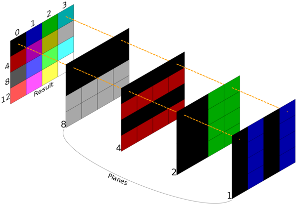

<!--@
TITLE=Every Game Has a New Feature
-->

# Every Game Has a New Feature #

Developing software like Camoto often takes a long time and can be extremely
involved and complex, yet it's not always apparent why.  One of the big reasons
is that so many games do things in completely unique ways, and trying to
represent this in a general manner (that is not specific to any one game) can be
a fiendishly complicated task.  Perhaps then, it is no surprise that there are
very few programs around that even attempt this.  Those that do, often work in a
very limited manner.  For example, only working with games that have very
similar engines, or working with archive formats only and ignoring graphics and
music, or only allowing files to be read but not modified.

Since Camoto works the same with vastly different games, and allows editing of
different classes of data (graphics, levels, music, etc.) it is one of a tiny
number of programs that encounter the issues below.  These issues have proved
many assumptions false, causing rewrites of large parts of the Camoto codebase,
as they have typically required a complete rethink about how the data should be
stored internally.

For example, when you have written your archive code to work like .zip files do,
what do you do when you come across your first archive format that does not use
any filenames?  How do you handle that?  In this case, all the filename code had
to be rewritten so that files could be specified by index as well as by name.
Then as soon as you have done that, the next format comes along which uses hash
values to encode the filenames, but these cannot be reversed to produce the
original filenames, as each hash matches a million or so possible strings.  What
then?

The following list details a few of these stumbling blocks that were encountered
during Camoto development.

## Explanations ##

This section provides a bit of background on various file formats.  You can skip
this section if you're willing to be confused when you get to the games below
:-)

### Planar graphics ###

This explains how the EGA stores graphics in video memory.

Most EGA graphics are stored in "planes", which is a little different to how
most people are used to thinking of graphics.  Most people imagine 24-bit true
colour storage, which arranged as a list of bytes, looks like this:

<table class="wikitable">
<thead>
<tr>
<th>Byte</th>
<th>0</th>
<th>1</th>
<th>2</th>
<th>3</th>
<th>4</th>
<th>5</th>
</tr>
</thead>
<tbody>
<tr>
<td>Value</td>
<td>0x11</td>
<td>0x11</td>
<td>0x11</td>
<td>0x22</td>
<td>0x22</td>
<td>0x22</td>
</tr>
<tr>
<td>Purpose</td>
<td>Red</td>
<td>Green</td>
<td>Blue</td>
<td>Red</td>
<td>Green</td>
<td>Blue</td>
</tr>
</tbody>
</table>

Which is 24-bit RGB data for two pixels.  Planar graphics store all the red
values first, then the green, and then the blue, like this:

<table class="wikitable">
<thead>
<tr>
<th>Byte</th>
<th>0</th>
<th>1</th>
<th>2</th>
<th>3</th>
<th>4</th>
<th>5</th>
</tr>
</thead>
<tbody>
<tr>
<td>Value</td>
<td>0x11</td>
<td>0x22</td>
<td>0x11</td>
<td>0x22</td>
<td>0x11</td>
<td>0x22</td>
</tr>
<tr>
<td>Purpose</td>
<td>Red</td>
<td>Red</td>
<td>Green</td>
<td>Green</td>
<td>Blue</td>
<td>Blue</td>
</tr>
</tbody>
</table>

On an EGA there are only 16 colours, so you end up with four planes, which are
one bit-per-pixel each (1bpp - meaning each byte contains data for eight pixels,
because there are eight bits in a byte.)  If a bit is set to one in the red
plane, then that pixel will show up red on the screen.  If the first bit is set
to one in both the red and blue planes, it will show up as magenta on the
screen.

I have drawn a diagram on the right which will hopefully explain it a little
better.  There might also be more detail in the [Wikipedia Planar
article](https://en.wikipedia.org/wiki/Planar_(computer_graphics)).

## The Games ##

### Blood ###

* The [RFF Format](https://moddingwiki.shikadi.net/wiki/RFF_Format) encrypts its
  files with a simple XOR algorithm, but it only encrypts the first 256 bytes.
  So the existing XOR cipher filter had to be modified so that it only acted on
  the first X number of bytes, and passed the rest of the data through
  unchanged.

* The RFF's FAT is stored at the end of the file, which luckily had been
  implemented thanks to [[#Lion King, The|The Lion King]]'s EPF format.  However
  RFF takes this a step further, and encrypts the whole FAT.  To make matters
  even worse, the encryption key depends on the FAT's offset - so every time you
  add, remove or resize a file, the FAT will move (because it's at the end of
  the archive) and the entire thing has to be re-encrypted!  In the end the easy
  way out was taken, and the FAT was decrypted into a block of memory when the
  RFF file is opened, and only encrypted and written back out just before the
  RFF file is closed.  This method (using a block of memory as opposed to
  writing the FAT out from the existing memory structures) was chosen as there
  are a few fields in the FAT that are currently unknown, and this method
  preserves that information.

* The RFF file also appears to store last-modified dates of the files it
  contains.  As yet this information is not accessible through libgamearchive,
  however (per previous point) this information is not lost when existing files
  are modified.

### Commander Keen ###

* The GAMEMAPS format has an external FAT like Halloween Harry's BNK, but each
  "file" points to a structure that contains the offsets of three data chunks.
  Thus you can't present the structure as a file because the offsets won't be
  valid (and the data at those offsets will be missing), so these offsets have
  to be part of the archive structure.  But the map dimensions are included in
  with these offsets, so if the offsets aren't made available as files, there
  will be no way for an editor to access the map width and height! At the
  time of writing, the current plan is to make each of the three chunks (map
  layers) available as separate files within a folder, and to provide a fourth
  "fake file" that just contains the map width and height fields.  The drawback
  with this method is that it doesn't fit in with the way all the other archive
  formats work, because you can't add or remove arbitrary data.  Likewise adding
  new levels becomes a challenge - how do you figure out from a filename which
  structure the file should go into, and which layer it should appear in there?

### Duke Nukem II ###

* The "actors" in Duke II have an offset applied to them, so that the image
  appears in a slightly different location to the actual grid where it's stored.
  This allows you to do nice things like put all your sprites one grid-space
  above the floor, and have them all standing on the ground regardless of their
  height (as opposed to Xargon, which requires that each sprite is positioned a
  varying distance above the ground depending on its height.)  Since DukeII was
  the first game with this offset, it required additions to the map editor...

* The tilesets are not fixed, but their filenames are stored in the map file.
  This does make things flexible, but when all the existing games are hard
  coded, it's time to make everything dynamic... (this was later encountered in
  Monster Bash and Word Rescue, so it was worth implementing as it did get some
  reuse!)

### Halloween Harry ###

* The tileset palette is stored in the map file!!  This means the map file has
  to be loaded any time image files need to be viewed...

* Harry's [BNK
  format](https://moddingwiki.shikadi.net/wiki/BNK_Format_(Halloween_Harry)) was
  the first archive format implemented that stored the FAT (the list of
  filenames) in a separate file.  This required adding a whole new class of
  "supplementary files" to the library, so that library users would be aware of
  any additional files required when opening a given archive.

### Hugo's House of Horrors series ###

* Hugo 3's [DAT format](https://moddingwiki.shikadi.net/wiki/DAT_Format_(Hugo))
  is one of the very few archive formats where files are stored out of order.
  In almost all other formats the order of the files in the FAT reflects the
  order the data will be found in the rest of the archive.  This means when
  referring to a file by an order number, it must be clear it is the order of
  the file in the FAT, not the order of the file in the archive's content block.

* In Hugo 3, the data is split between two files, but the FAT for both files is
  stored in the first one.  This makes it hard to figure out where the first
  file stops and the second one begins, because suddenly the file offsets in the
  FAT jump back to low values again.  But you have to be careful when looking
  for this switch, because the files can sometimes jump back to low offsets
  without switching files since they are often stored out of order!

### Incredible Machine, The ###

* The [TIM Resource
  Format](https://moddingwiki.shikadi.net/wiki/TIM_Resource_Format) has one FAT
  file and multiple data files.  If you open the FAT file once and present all
  the files, there is no way to control which data file a newly inserted file
  ends up in.  If you open the data files independently this isn't a problem,
  but then if the Camoto GUI opens all of the data files at once, the single FAT
  will be opened multiple times and one change could corrupt the FAT seen by the
  others!

### Kiloblaster ###

* Music files use two percussive instruments which share the same OPL channel,
  so they share the same frequency.  But the game plays both notes
  simultaneously at different pitches, causing a conflict!  Turns out the order
  of events is important, even when those events are supposed to occur at the
  same instant.  It was too difficult to come up with an elegant way of
  prioritising simultaneous notes, so instead the note pitch is overridden to
  that of the correct (last) note played in the instant.

### Lion King, The ###

* Until the [EPF Format](https://moddingwiki.shikadi.net/wiki/EPF_Format) was
  implemented, each archive could have its FAT (the list of filenames) stored at
  the start, or embedded throughout the archive.  EPF introduced a new version,
  where the FAT is stored at the very end of the file.  This required very
  careful planning, because now updating the FAT couldn't use fixed offsets.
  Updating a file's fields means the data for the FAT has to be written to a
  different location depending on whether the file data has been added yet or
  not.  In most cases this means creating room for the new file in the FAT at
  location #1, then inserting data for the file, then moving the FAT, and
  writing the rest of the information at location #2.

* The EPF format also uses the same LZW compression algorithm as Monster Bash,
  however it had to undergo a significant update because the EPF version of the
  algorithm packs the bits into bytes in the opposite order to Monster Bash.  So
  where Monster Bash might write the binary value 11100001, EPF writes 10000111.

### Monster Bash ###

* This game has unique method of storing graphics.  Since it is EGA the image
  data is planar, but there is an interesting optimisation in use.  Most games
  simply store all four EGA planes (sometimes with a fifth 'transparency'
  plane), which puts four or five 1bpp images onto the disk.  The sprites from
  Monster Bash however, can use each on-disk plane for more than one on-screen
  planes. For example, a bright magenta image (red + blue + intensity =
  bright magenta) will normally be saved as four 1bpp images - one for red (all
  ones), green (all zeroes), blue (all ones) and intensity (all ones).  Monster
  Bash images however recognise this redundancy and will save only two planes,
  an 'all ones' plane marked as red+blue+intensity, and an all-zeroes plane
  marked as 'green' (sometimes I think this may even be left out if it's all
  zeroes.)

* Maps are split across different files, so you need to read in at least three
  files to draw one level, not counting additional graphics files to draw the
  tiles.

* Point items stored in the foreground layer have to have a special value set on
  the corresponding background tile, so if you don't write to the background
  tile if the foreground tile is changed, the player won't be able to collect
  the point item.

* The [DAT
  format](https://moddingwiki.shikadi.net/wiki/DAT_Format_(Monster_Bash)) was
  also the first implemented that compresses its files.  This required adding
  "filters" to the library, so that files could be passed through a
  decompression filter to recover their original contents.  The filters also had
  to advise the archive file of the "prefiltered" size when saving data to a
  file, because the DAT format stores both the compressed and uncompressed size
  of each file. The terminology here is extremely confusing, and went
  through a few alternatives.  It started out as "prefiltered" and
  "postfiltered" sizes, but the meaning of these terms change depending on
  whether a file is being read or written - when reading a file the prefiltered
  size is the compressed size, as it gets passed through a decompression filter.
  But when writing a file the uncompressed size is the prefiltered size, as it
  is being passed through a compression filter!  In the end the terminology
  adopted was "real size" and "stored size", which still isn't perfect but it
  has reduced the confusion somewhat.

* The DAT format also uses RLE (run-length encoding) to further compress files
  before they are LZW compressed.  Since the archive format stores both the
  compressed and decompressed sizes for each file, this required careful coding
  to ensure that when filters are chained together (in this case the standard
  LZW compressor and the Monster Bash RLE encoder) the original file size is
  correctly recorded.  This is trickier than it sounds - the RLE encoder runs
  first and knows the size of the original uncompressed data, but it doesn't
  know the final compressed file size because the LZW compressor hasn't run yet.
  The LZW compressor knows the final compressed size but not the original size
  because it was given data that had already been RLE-encoded.  So special care
  has to be taken to ensure the first filter (the RLE-encoder in this case)
  passes the original real/prefiltered size down the chain so that the last
  filter (the one that knows the final stored/postfiltered size) can obtain it
  and pass both size values to the archive handler.

### Stellar 7 ###

* The [RES format](https://moddingwiki.shikadi.net/wiki/RES_Format_(Stellar_7))
  was the first one that included subfolders.  This required adding the ability
  to open folders as well as files within the archive code.

### Word Rescue ###

* Levels can have a background colour set instead of a backdrop image.

* Music files are the only CMFs I have ever found that use the default
  instruments.

### Vinyl Goddess From Mars ###

* The tilesets do not use raw pixel values, but a lookup table.  Each tile has a
  16-bit integer for each group of four pixels, which is an index into a table
  of possible pixel values.  When writing a tile, the pixels are checked to see
  if they exist in the table first, and only appended to the table if they don't
  exist.  In theory this would compress the data by exactly half (two byte
  lookup value written instead of four bytes for four pixels), except that the
  lookup table has to be written out afterwards, reducing the overall amount of
  compression.  One wonders whether there is much of a saving at all, for all
  the complexity...

* Then the full screen images are horizontally interlaced, with each byte
  representing every fourth pixel.  Apparently this matches the memory layout of
  the video mode in use, but of course this was the first (and at the time of
  writing, only) game that does this.

* Not to mention the [LBR archive
  format](https://moddingwiki.shikadi.net/wiki/LBR_Format) using hashes instead
  of filenames.  Even to this day some of the filenames are unknown as they are
  never referenced in the game!  (See http://www.shikadi.net/pckf/vgfm-lbr.html
  if you're feeling lucky...)

### Zone 66 ###

* Maps have a data file which stores the mapping between map codes and tile
  numbers.  Which is fine, except that file also controls which tiles animate,
  which can be destroyed, and what tiles to replace them with when they are
  destroyed.  Since Camoto was designed to be able to write a map with no
  additional data present, this means all this extra data must be loaded when
  the level is opened, and written back out when the level is saved again, even
  though all that data will never be used in the map editor (only a tileinfo
  editor would use it.)

* Most of the files are compressed with an entirely unique algorithm.  It's
  based on LZW, but unlike LZW, after every byte of compressed data is written,
  a byte of uncompressed data follows.  It makes one wonder whether this was
  intentional to obfuscate the data or whether it was a mistake in the
  algorithm...
