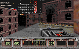

<!--@
TITLE=Duke/SW Maps
-->
# Duke 3D / Shadow Warrior maps #

This page contains all the Duke Nukem 3D and Shadow Warrior maps I've made.
The screenshots next to the map should give you an idea of what the map is like.
All the maps come with a description file, so please keep it intact if you
redistribute any of the maps.

The "release version" number is the version of the map, so release&nbsp;1 is
older than release&nbsp;2.

<!-- Next Map -->
<TABLE WIDTH=100% CELLPADDING=0 CELLSPACING=0 BORDER=0 class="dukemap"><TR><th>Adam's House</th></TR></TABLE>
<TABLE WIDTH=100% BORDER=0 CELLSPACING=2 CELLPADDING=1 class="dukemap-sub"><TR>
<th>
<B>Platform</B>
</th>
<th>
<B>Release Version</B>
</th>
<th>
<B>Development Time</B>
</th>
<th>
<B>Size (uncompressed)</B>
</th>
</TR><TR>
<TD>
Duke Nukem 3D (Atomic Editon)
</TD>
<TD>
Release 2
</TD>
<TD>
6 months on/off
</TD>
<TD>
149K
</TD>
</TR></TABLE>
<TABLE WIDTH=100% BORDER=0 CELLSPACING=0 CELLPADDING=2><TR><TD VALIGN=TOP>
<TABLE BORDER=0 CELLSPACING=0 CELLPADDING=1><TR>
<TD></TD>
<TD></TD>
<TD></TD></TR><TR>
<TD></TD>
<TD></TD>
<TD></TD>
</TR></TABLE>
</TD><TD VALIGN=CENTER>

This map was the first real DukeMap I made (apart from all the test maps.)
This one is based on my house in real life.  There are a couple of bugs in it,
but nothing critical, although there is one major design fault - it's big.  In
real life, the door knobs are at my waist, not above my head...

<A HREF="http://files.shikadi.net/malv/files/maps/adhouse.zip">Adam's House (38.5K)</A>

</TD></TR></TABLE>  

<!-- Next Map -->
<TABLE WIDTH=100% CELLPADDING=0 CELLSPACING=0 BORDER=0 class="dukemap"><TR><th>My Test Map</th></TR></TABLE>
<TABLE WIDTH=100% BORDER=0 CELLSPACING=2 CELLPADDING=1 class="dukemap-sub"><TR>
<th>
<B>Platform</B>
</th>
<th>
<B>Release Version</B>
</th>
<th>
<B>Development Time</B>
</th>
<th>
<B>Size (uncompressed)</B>
</th>
</TR><TR>
<TD>
Duke Nukem 3D
</TD>
<TD>
Release 1
</TD>
<TD>
4 months on/off
</TD>
<TD>
24.7K
</TD>
</TR></TABLE>
<TABLE WIDTH=100% BORDER=0 CELLSPACING=0 CELLPADDING=2><TR><TD VALIGN=TOP>
<TABLE BORDER=0 CELLSPACING=0 CELLPADDING=1><TR>
<TD></TD>
<TD></TD>
<TD></TD>
</TR></TABLE>
</TD><TD VALIGN=CENTER>

This map was the first big map I made.  It's not really meant for playing, it's
just that when I wanted to test something I would put it in this map and if it
worked, left it there.  Note the "secret" automatically opening doors.  There
are heaps of bugs in this map, but all of them visual and not critical.  I only
know of one other group of map designers who have come across the error of
parallaxed ceilings on subways.  If you parallax a subway's ceiling, it drives
around in circles shooting RPGs...

<A HREF="http://files.shikadi.net/malv/files/maps/cooltest.zip">My Test Map (6.35K)</A>

</TD></TR></TABLE>  

<!-- Next Map -->
<TABLE WIDTH=100% CELLPADDING=0 CELLSPACING=0 BORDER=0 class="dukemap"><TR><th>Stadium</th></TR></TABLE>
<TABLE WIDTH=100% BORDER=0 CELLSPACING=2 CELLPADDING=1 class="dukemap-sub"><TR>
<th>
<B>Platform</B>
</th>
<th>
<B>Release Version</B>
</th>
<th>
<B>Development Time</B>
</th>
<th>
<B>Size (uncompressed)</B>
</th>
</TR><TR>
<TD>
Shadow Warrior
</TD>
<TD>
Release 1
</TD>
<TD>
About 10 mins
</TD>
<TD>
9.93K
</TD>
</TR></TABLE>
<TABLE WIDTH=100% BORDER=0 CELLSPACING=0 CELLPADDING=2><TR><TD VALIGN=TOP>
<TABLE BORDER=0 CELLSPACING=0 CELLPADDING=1><TR>
<TD></TD>
<TD></TD>
<TD></TD>
</TR></TABLE>
</TD><TD VALIGN=CENTER>

I always thought that Duke's Stadium was a great level, so I decided to convert
it into Shadow Warrior.  I originally decided to write DUKE2SW to convert my
house map into a Shadow Warrior map, but I never really finished it.  It only
converts the tiles now, and so I used it to convert all the tiles to Shadow
Warrior.  Then I changed the blimp and the elevator at the start to SW, and
here it is!

<A HREF="http://files.shikadi.net/malv/files/maps/stadium.zip">Stadium (3.29K)</A>

</TD></TR></TABLE>  

<!-- Next Map -->
<TABLE WIDTH=100% CELLPADDING=0 CELLSPACING=0 BORDER=0 class="dukemap"><TR><th>The Better Lo Wang Rally</th></TR></TABLE>
<TABLE WIDTH=100% BORDER=0 CELLSPACING=2 CELLPADDING=1 class="dukemap-sub"><TR>
<th>
<B>Platform</B>
</th>
<th>
<B>Release Version</B>
</th>
<th>
<B>Development Time</B>
</th>
<th>
<B>Size (uncompressed)</B>
</th>
</TR><TR>
<TD>
Shadow Warrior
</TD>
<TD>
Release 1
</TD>
<TD>
2 hours
</TD>
<TD>
92.5K
</TD>
</TR></TABLE>
<TABLE WIDTH=100% BORDER=0 CELLSPACING=0 CELLPADDING=2><TR><TD VALIGN=TOP>
<TABLE BORDER=0 CELLSPACING=0 CELLPADDING=1><TR>
<TD></TD>
<TD></TD>
<TD></TD></TR><TR>
<TD></TD>
<TD></TD>
</TR></TABLE>
</TD><TD VALIGN=CENTER>

This level is basically Lo Wang Rally, with a couple of extra secrets in it.
You can now access most of the other areas that you couldn't before (such as on
top of the buildings). Anyway, this was just to "improve" the map a bit ;-)

Look out for the hidden slope!

<A HREF="http://files.shikadi.net/malv/files/maps/coolrush.zip">Cool Rush (30.6K)</A>

</TD></TR></TABLE>  

<!-- Next Map -->
<TABLE WIDTH=100% CELLPADDING=0 CELLSPACING=0 BORDER=0 class="dukemap"><TR><th>Capture The Flag - Woods</th></TR></TABLE>
<TABLE WIDTH=100% BORDER=0 CELLSPACING=2 CELLPADDING=1 class="dukemap-sub"><TR>
<th>
<B>Platform</B>
</th>
<th>
<B>Release Version</B>
</th>
<th>
<B>Development Time</B>
</th>
<th>
<B>Size (uncompressed)</B>
</th>
</TR><TR>
<TD>
Shadow Warrior
</TD>
<TD>
Release 3
</TD>
<TD>
10 hours
</TD>
<TD>
41.6K
</TD>
</TR></TABLE>
<TABLE WIDTH=100% BORDER=0 CELLSPACING=0 CELLPADDING=2><TR><TD VALIGN=TOP>
<TABLE BORDER=0 CELLSPACING=0 CELLPADDING=1><TR>
<TD></TD>
<TD></TD>
<TD></TD></TR><TR>
<TD></TD>
<TD></TD>
<TD></TD>
</TR></TABLE>
</TD><TD VALIGN=CENTER>

I was originally going to do more than one CTF level, i.e. Woods, City, Space,
etc, but I never got around to it.  It has four bases (blue, red, green and
yellow), giving the possibility of up to four teams.  Each base has a "secret"
way of defending it's flag, although some secrets aren't as good as others
(this is supposed to be used as a handicap).  It's a fairly simple map,
although pretty fun to play.  It is my personal favourite out of all my maps ;-)

<A HREF="http://files.shikadi.net/malv/files/maps/ctfwoods.zip">CTFWoods (12.4K)</A>

</TD></TR></TABLE>  
