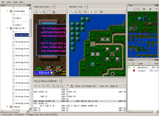
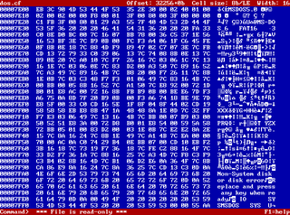
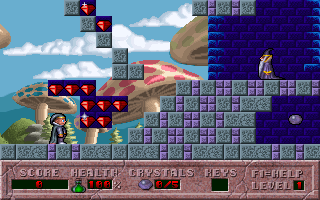
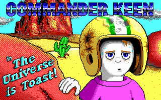

<!--@
TITLE=shikadi.net
-->
Welcome to shikadi.net, a site primarily dedicated to "classic games" - those
from the early 1990s that ran on a PC under MS-DOS.

The [DOS Game Modding Wiki](http://moddingwiki.shikadi.net/) is hosted here,
which aims to document the file formats used by these games, as well as tools
that can be used to examine and modify the games.

There are also a few game-specific sites hosted here, including the
[Commander Keen Wiki](http://keenwiki.shikadi.net/) and [archived copies of
older fan sites](http://archive.shikadi.net/).

See the sidebar on the left for more.

<a href="camoto/">
<figure>

<figcaption>
Camoto: A program for modifying DOS games
</figcaption>
</figure>
</a>

<a href="camoto/">
<figure>

<figcaption>
LinuxList: A hex editor with CP437 glyphs
</figcaption>
</figure>
</a>

<a href="camoto/">
<figure>

<figcaption>
DOS Game Modding Wiki
</figcaption>
</figure>
</a>

<a href="camoto/">
<figure>

<figcaption>
Commander Keen Wiki
</figcaption>
</figure>
</a>

